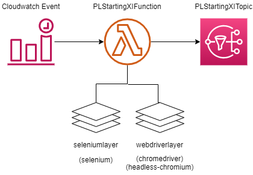

# PLStartingXI
## 概要
プレミアリーグの公式Webサイトから指定した試合のスターティングメンバーを取得して通知します。Lambda上でheadless-chromeを実行し、プレミアリーグの公式Webサイトからスターティングメンバーを取得し、SNSトピックから通知実行します。実行トリガーにはCloudwatch Eventを使用します。  
  
本リポジトリではLambdaLayer以外の構成を管理します。

## 使用方法
### 依存するLambdaLayerの作成
本リポジトリでは、以下のLambdaLayerを使用しています。
 - webdriverlayer  
 chromedriverとheadless-chromiumを格納しています。
 以下のサイトを参考にして作成してください。  
 https://masakimisawa.com/selenium_headless-chrome_python_on_lambda/
 - seleniumlayer  
 seleniumを格納しています。
 `pip install -t python/lib/python3.7/site-packages selenium` でZip化するディレクトリにseleniumを追加します。
### 対象の試合の設定
1. `template.yaml` のCloudWatchEventのルールを変更します。本リポジトリではRuleWOLEVEとしてWolverhampton Wanderers vs Evertonの試合を開始10分前に通知する設定が入っています。ScheduleExpressionに通知時間のcron式を、Targets.Inputのidに試合のIDを入力してください。
1. `template.yaml` のPermissionInvokeLambdaで設定されているSourceArnのRef関数を1で設定したCloudWatchEventに変更します。
### 通知方法の設定
1．`template.yaml` のサブスクリプションを変更します。本リポジトリではMyMailSubscriptionとしてメール送信の設定が入っています。

### デプロイ
ルートディレクトリで以下を実行
```
sam build
sam deploy
```
## 参考にしたWebサイト
 - Headless ChromeとChromeDriverについて参考にしました
 https://masakimisawa.com/selenium_headless-chrome_python_on_lambda/
 - プレミアリーグ公式Webサイトからのデータ取得について参考にしました
 https://medium.com/python-in-plain-english/how-to-build-a-football-dataset-with-web-scraping-d4deffcaa9ca

